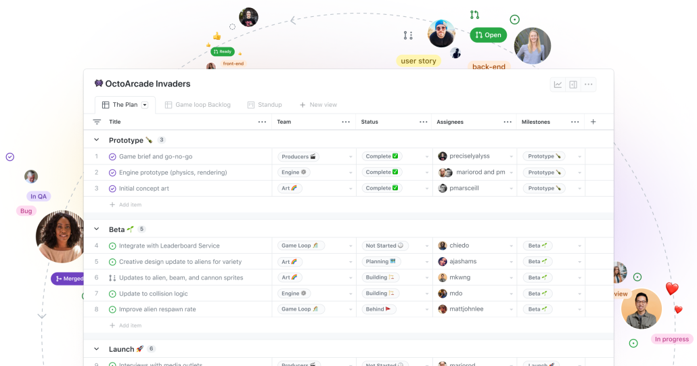

# Guía Rápida

## Overview

Esta guía rápida ayudará a realizar las siguientes actividades:

* [x] [Desarrollo diario o semanal con XP](quickstart.md#desarrollo-diario-o-semanal-con-xp)
* [x] [Revisión y retroalimentación de la iteración](quickstart.md#revision-y-retroalimentacion-de-la-iteracion)


Está guía esta dirigida a equipos de desarrollo de software que adoptan la Programación Extrema (XP). Se asume que tienes conocimientos básicos de:&#x20;

* [Principios ágiles](../basics/editor.md)
* [Historias de usuario](../basics/markdown.md)
* [Git y CI/CD](../basics/images-and-media.md)


## Antes de comenzar

Antes de ejecutar esta guía de inicio rápido, completa los siguientes prerrequisitos:

* [x] Acceso a una herramienta de gestión de proyectos Github Projects.
* [x] Accesos a los Repositorios Git compartido con pipelines de CI/CD configurados.
* [x] Acuerdo sobre estándares de programación y marcos de prueba dentro del equipo.

<figure><figcaption></figcaption></figure>

## Desarrollo diario o semanal con XP

Para llevar a cabo el desarrollo diario o semanal se debe coordinar una reunión para realizar los siguientes pasos:


Se debe coordinar los tiempos y dias de desarrollo para terminar las tareas, estos tiempos serán coordinados por cada equipos, al menos una vez a la semana.




### Programación en pareja

Trabajar en parejas (<kbd>Driver</kbd> y <kbd>Navigator</kbd>). Elegir quien realizará el rol.

Definir tareas pequeñas de las historia de usuario o tarea recibida.

Intercambiar roles cada 15-30 minutos o después de finalizar una tarea/prueba.



### Desarrollo Dirigido por Pruebas (TDD)

Primero el <kbd>Navigator</kbd> escribir primero una prueba fallida.

El <kbd>Driver</kbd> escribe el código mínimo para aprobarla.

El <kbd>Navigator</kbd> debe realizar el code review mientras se realiza el código. (Esto incluye realizar revisión de arquitectura y estandares de código)

El <kbd>Driver</kbd> debe refactorizar inmediatamente.



### Integración continua

Commits e integraciones del código varias veces al día.


Es recomendable realizar cada que se realiza una tarea atomizada.


Asegurarse de que todas las pruebas unitarias se ejecuten automáticamente en cada integración.



### Pull Request y Code Review

El <kbd>Navigator</kbd> debe realizar el code review, al pull request generado al final del proceso de desarrollo, para asegurar la calidad del código y el seguimiento a los lineamientos o estandares de código definidos, además de asegurar el cumplimiento de la arquitectura definida.


Para etapas iniciales o cuando hay nuevos integrantes el que realiza el code review al final será el desarrollador con más experiencia.




### Reunión final

Realizar una pequeña retroalimentación para ordenar ideas y tareas, puede ayudar realizar las siguientes preguntas:

¿Qué hice ayer?

¿Qué haré hoy?

¿Tengo obstáculos?



## Revisión y retroalimentación de la iteración

Se realizará la reunión grupal al menos 1 vez por semana o 2 semanas para realizar el seguimiento y ver los resultados.



### Demostración de resultados

Presentar las historias completadas.

Recopilar retroalimentación y ajustar las prioridades.



### Retrospectiva

Discutir qué salió bien y qué se puede mejorar.

Definir una o dos acciones de mejora concretas para la siguiente iteración.



### Documentación

Cuando se termina de hacer una historia de usuario de manera completa, se procedera a realizar la documentación correspondiente a cada área.


La documentación a realizar son las guías de usuario, Open Api Documentation, mejoras y actualización de guía de desarrollador.



